# MLOps Assignment I — End-to-End ML Model Development, CI/CD, and Production Deployment

## 1. Objective
Build a machine learning classifier for heart disease prediction and deploy it as a cloud-ready, monitored API using modern MLOps best practices.

## 2. Repository Link
- **GitHub**: [github.com/chaitudevi/Heart-Disease-Classification-2](https://github.com/chaitudevi/Heart-Disease-Classification-2)

## 3. Dataset (Heart Disease UCI)
- **Source**: UCI Machine Learning Repository
- **Data acquisition**:
  - Script: `src/data/download_data.py`
  - Raw data folder: `data/raw/`

### Screenshot(s)
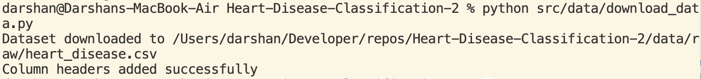

## 4. Data Acquisition, Cleaning, and EDA (Task 1 — 5 marks)
### 4.1 Data Cleaning & Preprocessing
- Missing value handling, encoding, transformations
- Implementation: `src/data/preprocess.py`

### 4.2 EDA
- Notebook: `notebooks/01_eda.ipynb`
- Visuals: class balance, correlation heatmap, distributions

### Screenshot(s)


## 5. Feature Engineering & Model Development (Task 2 — 8 marks)
### 5.1 Feature Pipeline
- Implementation: `src/features/feature_pipeline.py`

### 5.2 Models
- Logistic Regression
- Random Forest

### 5.3 Evaluation
- Cross-validation metrics: accuracy, precision, recall, ROC-AUC
- Training entrypoint: `src/models/train.py`

### Screenshot(s)
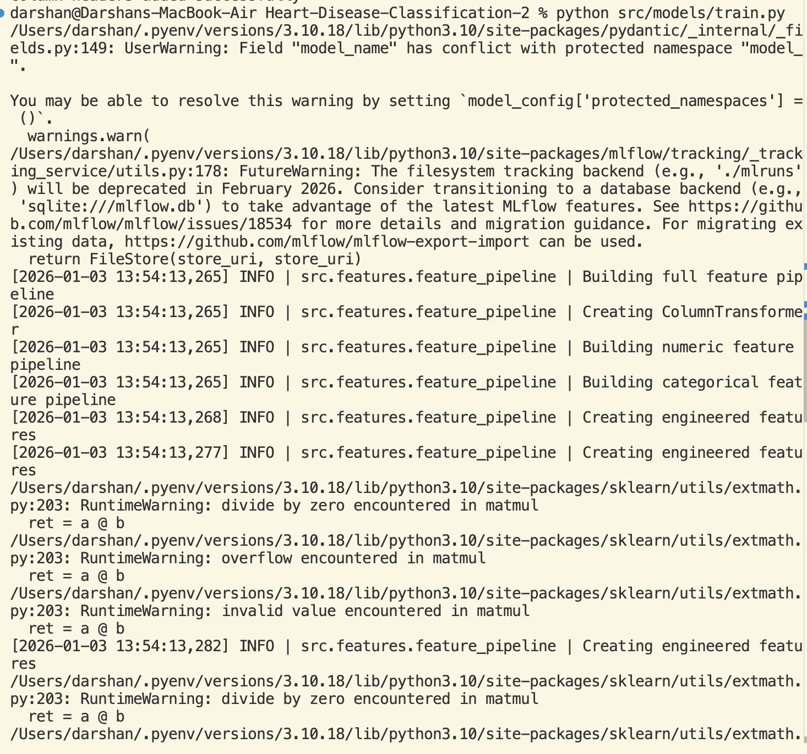
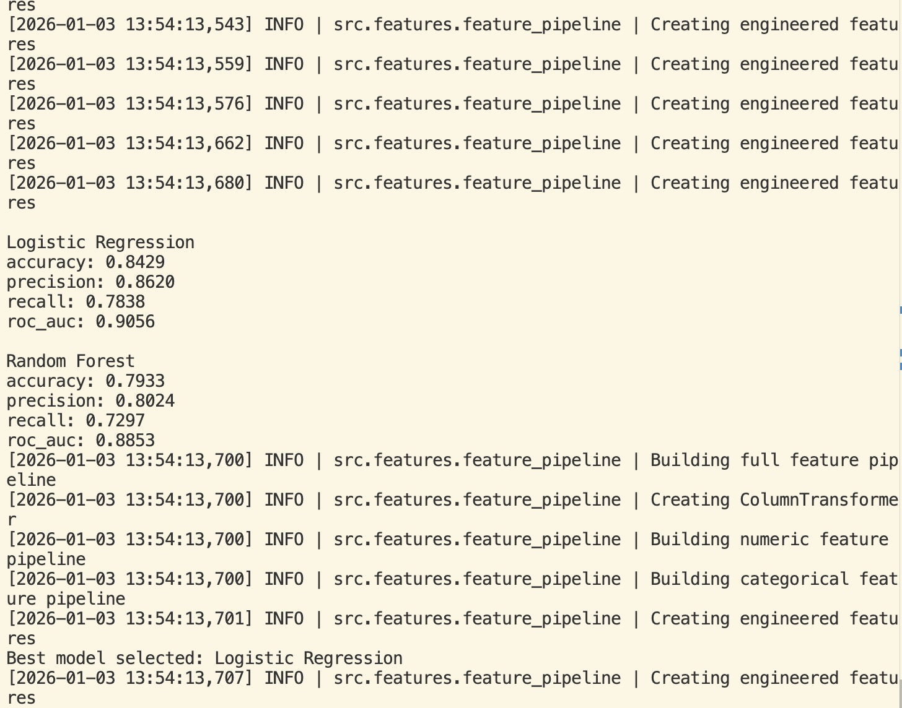

## 6. Experiment Tracking (Task 3 — 5 marks)
- Tool: MLflow
- Logged:
  - Parameters
  - Metrics
  - Artifacts (ROC curve, confusion matrix, reports)

### Screenshot(s)
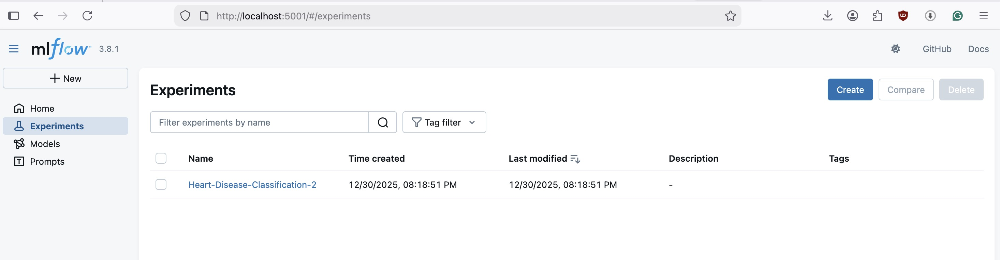

## 7. Model Packaging & Reproducibility (Task 4 — 7 marks)
- Model bundle saved at: `artifacts/model.pkl`
- Reproducible environment: `requirements.txt`
- Preprocessing/feature transformations are part of the saved sklearn `Pipeline`

### Screenshot(s)

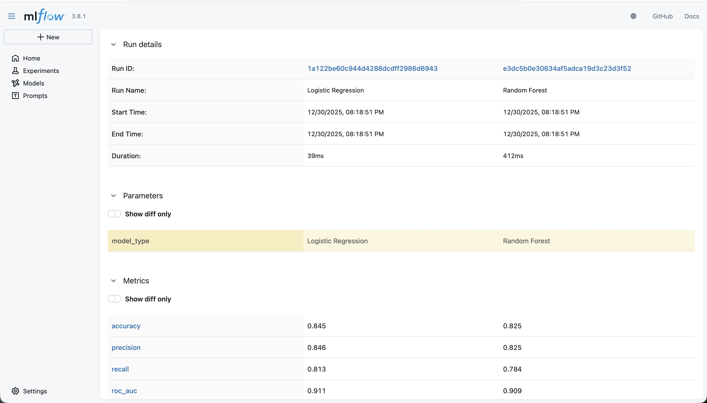
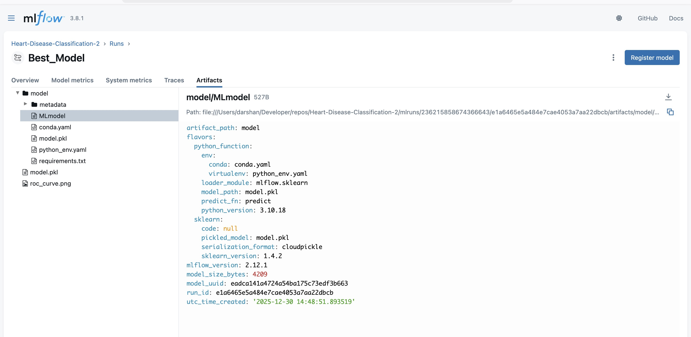

## 8. CI/CD Pipeline & Automated Testing (Task 5 — 8 marks)
- Tests under: `tests/`
- CI workflow: `.github/workflows/github_actions.yaml`
- Stages: lint, test, train

### Screenshot(s)

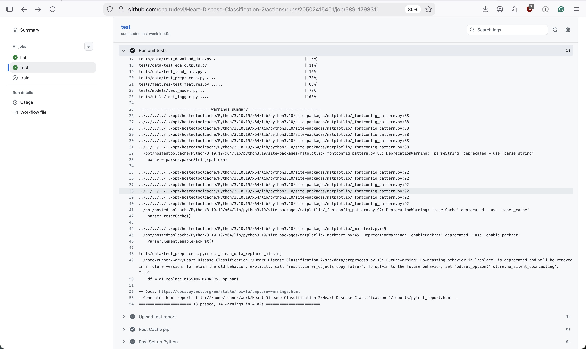
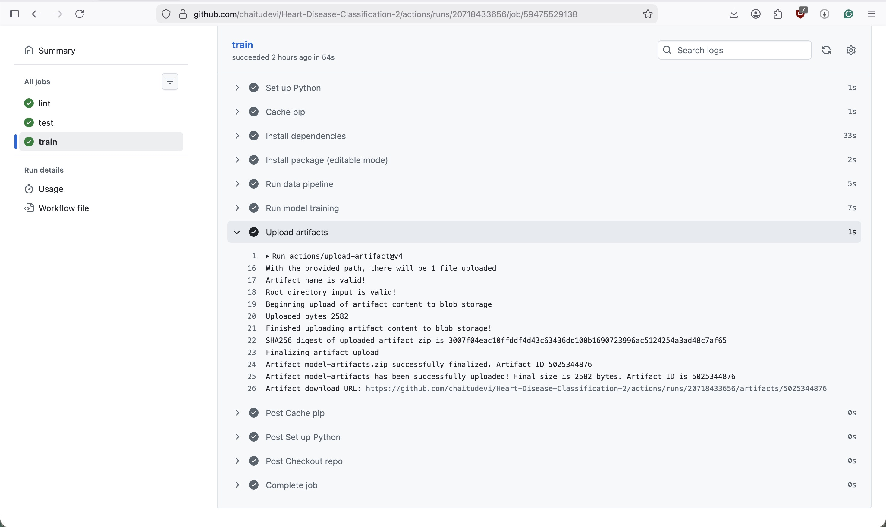

## 9. Model Containerization (Task 6 — 5 marks)
- Dockerfile: `Dockerfile`
- API:
  - `/predict` accepts JSON, returns prediction + confidence
  - `/metrics` exposes Prometheus metrics

### Screenshot(s)
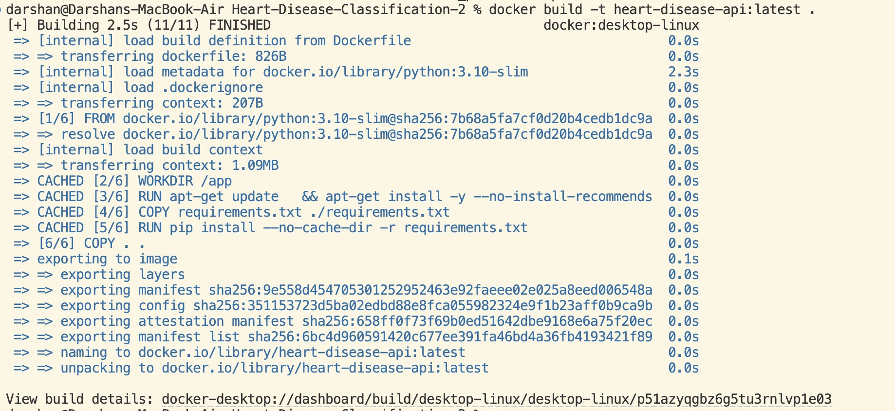
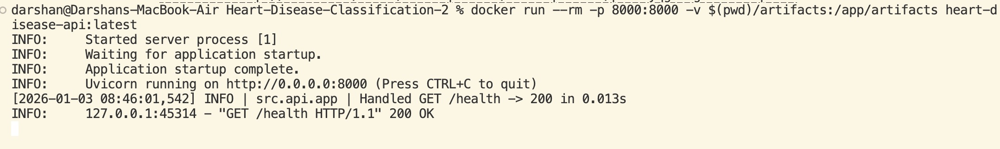
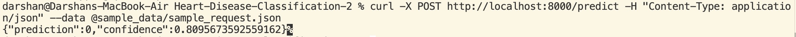

## 10. Production Deployment (Task 7 — 7 marks)
You deployed on **Docker Desktop Kubernetes** using manifests.

- Manifest: `k8s/deployment.yaml`
- Service exposure: LoadBalancer/NodePort

### Screenshot(s)
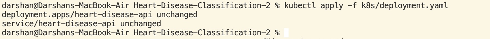

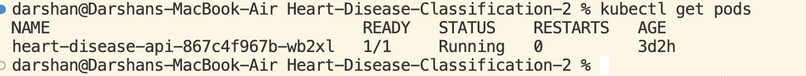

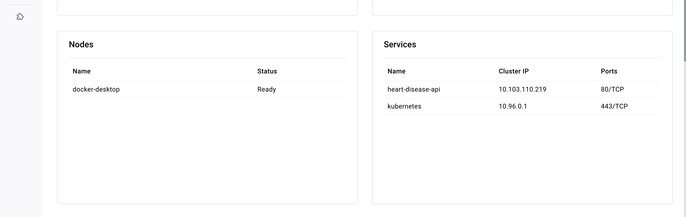

## 11. Monitoring & Logging (Task 8 — 3 marks)
### 11.1 API Logging
- Middleware request logging in: `src/api/app.py`

### 11.2 Metrics + Dashboards
- Metrics endpoint: `/metrics`
- Prometheus config: `monitoring/prometheus.yml`
- Grafana provisioning + dashboard:
  - `monitoring/grafana/provisioning/`
  - `monitoring/grafana/dashboards/heart-disease-api-dashboard.json`

### Screenshot(s)
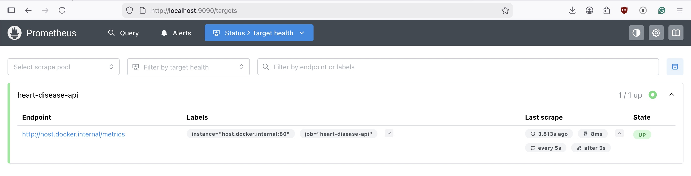

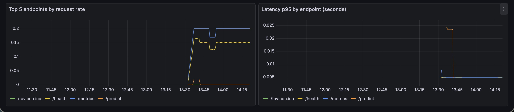
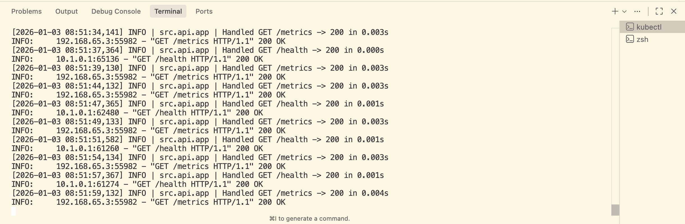

## 12. System Architecture Diagram
- Draw.io XML: `reports/system_architecture.xml`
- Architecture flow:

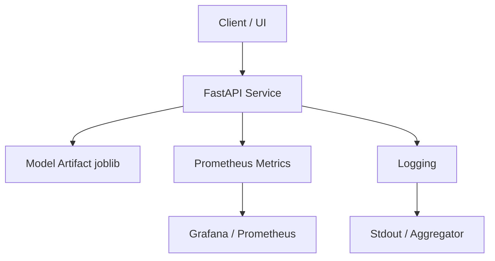

### Screenshot(s)
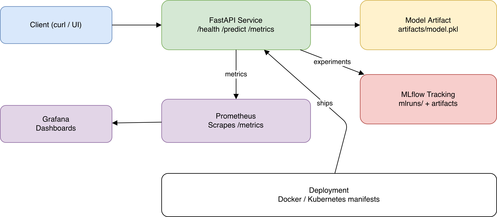

## 13. How to Reproduce (Production-Readiness)
### 13.1 From clean environment
```bash
# 1. Clone and setup
git clone https://github.com/chaitudevi/Heart-Disease-Classification-2
cd Heart-Disease-Classification-2
python -m venv venv && source venv/bin/activate
pip install -r requirements.txt

# 2. Data pipeline
python src/data/download_data.py
python src/data/load_data.py

# 3. Train model (generates artifacts/model.pkl)
python src/models/train.py

# 4. Run API locally
uvicorn src.api.app:app --host 0.0.0.0 --port 8000

# 5. Test API
curl -X POST http://localhost:8000/predict -H "Content-Type: application/json" \
  -d @sample_data/sample_request.json

# 6. Run tests
pytest tests/ -v

# 7. Build container
docker build -t heart-disease-api .

# 8. Deploy to Kubernetes
kubectl apply -f k8s/deployment.yaml

# 9. Start monitoring stack
docker-compose -f docker-compose.monitoring.yml up -d

# 10. View MLflow experiments
mlflow ui --host 0.0.0.0 --port 5000
```

### 13.2 Key Config Files
- `monitoring/prometheus.yml`: Prometheus scrape config
- `monitoring/grafana/provisioning/`: Grafana auto-provision
- `k8s/deployment.yaml`: Kubernetes manifests
- `.github/workflows/github_actions.yaml`: CI/CD pipeline
- `src/models/train.py`: Training script with MLflow logging
- `src/api/app.py`: FastAPI app with metrics and logging

### 13.3 Ports & Endpoints
- API: http://localhost:8000 (or k8s service IP)
- Health: http://localhost:8000/health
- Metrics: http://localhost:8000/metrics
- Prometheus: http://localhost:9090
- Grafana: http://localhost:3000 (admin/admin123)
- MLflow: http://localhost:5000

## 14. Appendix: Evidence Checklist
- CI run screenshots
- Deployment screenshots
- Grafana dashboard screenshot
- MLflow runs screenshot
